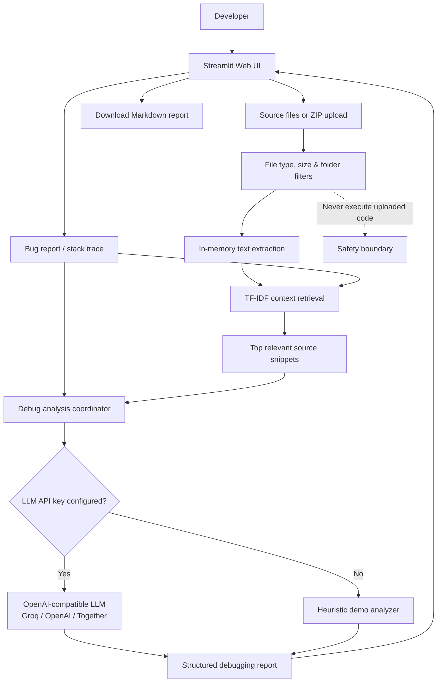

# 🛠️ DebugDesk AI

[](https://debugdesk-ai.streamlit.app/)
[](https://www.python.org/downloads/)
[](https://opensource.org/licenses/MIT)

> Turn error logs, stack traces, and code context into a practical debugging plan, root-cause hypothesis, and regression test suite.

🔗 **Live Public Demo**: [https://debugdesk-ai.streamlit.app/](https://debugdesk-ai.streamlit.app/)

---

## 📌 Overview

**DebugDesk AI** helps developers diagnose software bugs faster. Instead of simply pasting a generic error message into a chat interface, DebugDesk AI combines:
1. Your raw stack trace, exception, or failure description.
2. Your actual source code files or project ZIP archive.
3. In-memory TF-IDF context retrieval to identify the most relevant files and call sites.
4. An actionable, structured debugging report covering initial diagnosis, likely causes, code areas to inspect, step-by-step reproduction/fix steps, and recommended regression tests.

The app runs out-of-the-box in **Demo Mode** (zero setup or API key required) and seamlessly upgrades to **Model-Powered Mode** when an OpenAI-compatible LLM endpoint is configured.

---

## 🏛️ Architecture & Data Flow

GitHub natively renders the Mermaid diagram below representing the end-to-end data flow:



---

## ✨ Key Features

- **Multi-File & ZIP Ingestion**: Upload individual files or entire project ZIP archives. Automatically ignores dependencies (`node_modules`, `.venv`, `__pycache__`) and build artifacts.
- **Smart Lexical Retrieval**: Uses scikit-learn TF-IDF vectorization with n-grams to rank and pull the most relevant snippets connected to the stack trace.
- **Zero-Setup Demo Mode**: Built-in heuristic engine provides instant diagnostic checklists for common failure modes (import errors, undefined property access, connection timeouts, syntax issues) without external API costs.
- **Model-Powered Deep Analysis**: Connects to any OpenAI-compatible API (e.g. Groq, OpenAI, Together AI) for deep contextual analysis and code synthesis.
- **Markdown Export**: Download the entire diagnostic report with a single click for issue trackers, PR descriptions, or team review.
- **Secure by Design**: **Uploaded files are never executed.** Code is parsed strictly as passive text in transient memory.

---

## 🚀 Quickstart: Run Locally

### 1. Clone the repository
```bash
git clone https://github.com/rahul-1909/DebugDesk-AI.git
cd DebugDesk-AI
```

### 2. Create and activate a virtual environment
```bash
# Windows
python -m venv .venv
.venv\Scripts\activate

# macOS / Linux
python3 -m venv .venv
source .venv/bin/activate
```

### 3. Install dependencies
```bash
pip install -r requirements.txt
```

### 4. Launch the application
```bash
streamlit run app.py
```

The app will open automatically in your browser at `http://localhost:8501`.

---

## ⚙️ Configuration (Optional LLM Integration)

To enable model-powered analysis instead of demo mode, set the following environment variables or add them to `.streamlit/secrets.toml`:

```bash
LLM_API_KEY=your_api_key_here
LLM_BASE_URL=https://api.groq.com/openai/v1
LLM_MODEL=qwen/qwen3-32b
```

### For Streamlit Community Cloud:
1. Navigate to your app dashboard on [share.streamlit.io](https://share.streamlit.io/).
2. Click **Settings** > **Secrets**.
3. Add your secrets in TOML format:
   ```toml
   LLM_API_KEY = "your-api-key"
   LLM_BASE_URL = "https://api.groq.com/openai/v1"
   LLM_MODEL = "qwen/qwen3-32b"
   ```

---

## 🧪 Testing the Live App

1. Visit [https://debugdesk-ai.streamlit.app/](https://debugdesk-ai.streamlit.app/).
2. In the **Error message / bug report** field, enter:
   ```text
   ModuleNotFoundError: No module named 'requests'
   ```
3. Click **Analyze issue**.
4. The system will immediately return a multi-section debugging checklist with root causes and verification steps.

---

## 🔒 Security & Privacy

- **No Code Execution**: The app acts strictly as a static code analyzer. Uploaded source files are never run, compiled, or evaluated on the server.
- **Session-Only Processing**: All uploaded text remains in volatile session memory and is destroyed when the browser session ends.
- **No Secret Leakage**: Do not commit secrets or API keys to the repository.

---

## 📄 License

Distributed under the [MIT License](LICENSE).
